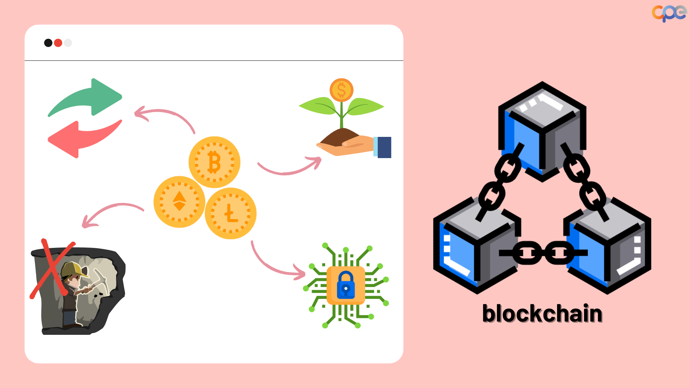
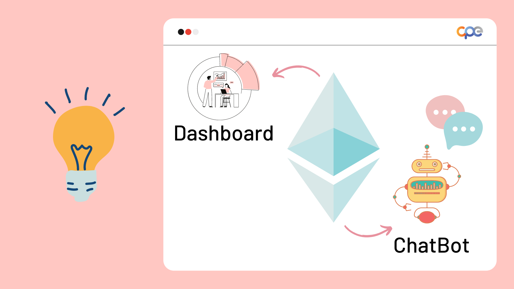
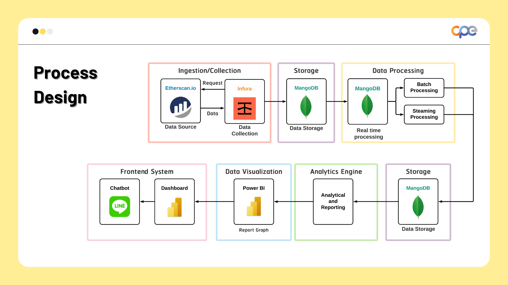
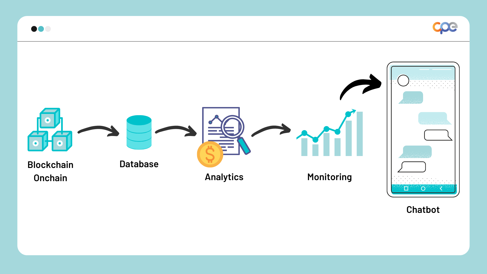

# Cryptocurrency Analysis for detecting and monitoring transactions of Ethereum coins

โปรเจ็คนี้เป็นส่วนหนึ่งของรายวิชา CPE401 COMPUTER ENGINEERING PROJECT I จัดทำโดย นักศึกษาวิศวกรรมคอมพิวเตอร์ ชั้นปี 4 มหาวิทยาลัยเทคโนโลยีพระจอมเกล้าธนบุรี

### :woman: Developer Team :woman:
Member in team : 
- :woman: Ms.Natchariya Wongamnuayporn 61070507204
- :woman: Ms.Tanchanok Prasootseangjan 61070507211
- :woman: Ms. Titirat	  Suwisut	       61070507236

# :memo: Project Description 

- ปัจจุบันเทคโนโลยีได้ก้าวหน้าไปอย่างมากไม่ว่าจะเป็นการเรียนรู้ของแบบจำลอง (Machine learning)ปัญญาประดิษฐ์ (Artificial intelligence) หุ่นยนต์ (Robot) หรือบล็อกเชนท์ (Blockchain) และ คริปโตเคอเรนซี่ (Cryptocurrency) ซึ่งคริปโตเคอเรนซี่เป็นเงินดิจิตัลประเภทหนึ่งที่ได้รับความสนใจจากนักลงทุนหรือนักศึกษาเป็นอย่างมาก เพราะคริปโตเคอเรนซี่เป็นเงินดิจิตัลที่มีบทบาทในการซื้อขายแลกเปลี่ยนสินค้าหรือการบริการได้ อีกทั้งเป็นการออมเงินแบบลงทุนที่ให้เงินสามารถหาเงินเองได้ โดยไม่ต้องออกแรงเพื่อแลกกับเงินเดือน ซึ่งหลักการทำงานและการจดบันทึกข้อมูลของผู้ถือเหรียญนั้น ๆ จะมีความปลอดภัย มีระบบรักษาที่ดี และเปลี่ยนแปลงข้อมูลได้ยาก เรียกระบบนี้ว่า บล็อกเชนท์
การลงทุนเกี่ยวกับเงินดิจิตัล เป็นการลงทุนที่มีความเสี่ยงที่สูง แต่ก็ได้ผลตอบแทนที่สูงเช่นกัน เนื่องจากไม่มีหน่วยงานรัฐใด ๆ เข้ามาควบคุมดูแล ไม่มีกฎหมาย 
ซึ่งคริปโตเคอเรนซี่จะขึ้นอยู่กับปัจจัยต่าง ๆ ที่มีผลต่อการเปลี่ยนแปลงกราฟของสกุลเงินดิจิตัล

- ทางคณะผู้จัดทำได้มีแนวคิดเกี่ยวกับการลงทุนแบบเงินดิจิตัลที่มีความเสี่ยง จึงมีสนใจที่อยากจะศึกษาเรื่องคริปโตเคอเรนซี่ ซึ่งเป็นการศึกษาที่เกี่ยวกับการตรวจจับการทำธุรกรรมของเหรียญอีเธอเรียม โดยอยู่ในรูปแบบของโปรแกรมคอมพิวเตอร์ที่จำลองบทสนทนาของมนุษย์ที่สามารถสื่อสารผ่านข้อความ (chatbot) เพื่อให้ผู้ที่สนใจลงทุนด้านคริปโตเคอเรนซี่ สามารถรับรู้การเปลี่ยนแปลงตลาดการแลกเปลี่ยนของเงินดิจิตัล
อีเธอเรียมได้ เนื่องจากที่อยู่ (Address) ที่มีการทำธุรกรรมในจำนวนมาก อาจส่งผลต่อการเปลี่ยนแปลงของกราฟ โดยทางคณะผู้จัดทำได้มีการศึกษาข้อมูลเกี่ยวกับข้อมูลบนห่วงโซ่ของบล็อกเชนท์ (Onchain data) ที่เป็นตัวจัดเก็บข้อมูลในเครือข่ายของบล็อกเชนท์ สำหรับคริปโตเคอเรนซี่เช่นกัน

### Requirements in project 

  

# :globe_with_meridians::desktop_computer:Link to Products :white_heart::black_heart:
- :globe_with_meridians: Chatbot link : [EtherBot!](https://liff.line.me/1645278921-kWRPP32q/?accountId=949lzjrt) :white_heart:
- :globe_with_meridians::desktop_computer: API link : [EtherBot.Dataservice API!](https://etherbot2022.herokuapp.com/docs) :white_heart::black_heart:
- :desktop_computer: Dashboard link : [EtherBot Analysis dashboard!](https://shorturl.asia/nZT2Y) :black_heart:

# :gear: Tools in Project
- [X] Visual Studio Code (VS code) > implement data process
- [X] Jupyter Python > analytics data 
- [X] DialogFlow > develop chatbot 
- [X] Line Developer & Line Office Account Manager > connection line
- [X] Heroku server > run API for real time 
- [X] Flask > implement API service

# :hammer_and_wrench: System in project
### Backend system

  

### Process in project

  

# :hammer_and_wrench: Version Product
- [X] EtherBot version 0.0.0 
